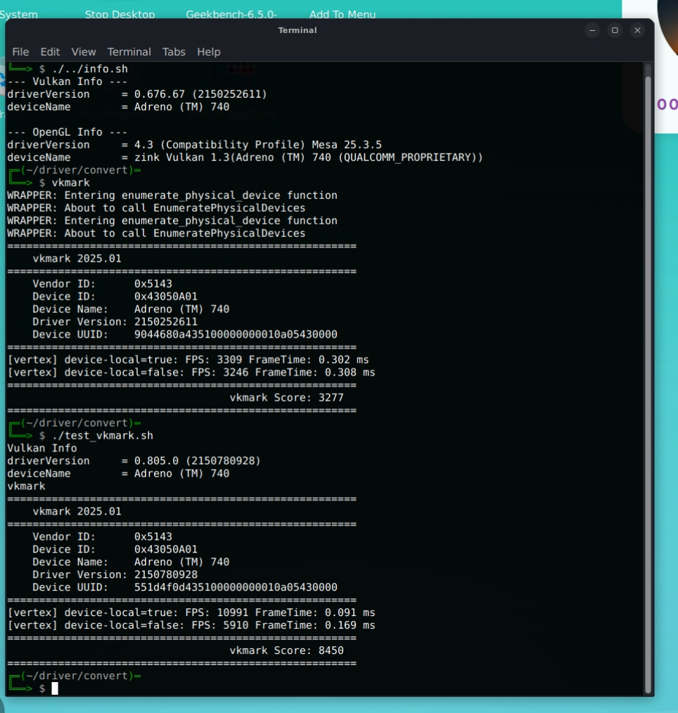

# AdrenoToolsDrivers_termux

With this project you will be able to use proprietary Adreno Vulkan driver across SoC generations in termux without root


like libadrenotools for other apps like ppsspp or gamehb

### Dependencies
```bash
pkg install clang cmake ninja vulkan-headers vulkan-tools libxcb libx11 xorgproto
```

### install.sh

```bash
./install.sh 805.zip
```

is creates an work and driver directory ~/.driver 

```bash
./install.sh -c 
```
to cleanup Everything generated by the script

1. Unpacks the driver zip file
2. Locates the Vulkan driver
3. building Vulkan Proxy vkproxy.so
4. patching libvulkan_wrapper.so to use vkproxy.so
5. write the vulkan icd json
6. Print GPU Info hopefully with the selected Driver, haha
  if not it dosnt work... 
  
  maybe you have an sd8gen2 and try driver "849" for gen5, adreno drivers may work across 2-3 generations.
  
  my sd8gen2 on my redmagic has an Adreno 740, android system driver is 0.676.76, vulkan 1.1, even 0.840.0, Vulkan 1.4
  
  

The driver (like 805.zip) are from: [K11MCH1/AdrenoToolsDrivers](https://github.com/K11MCH1/AdrenoToolsDrivers)
The goal is to be able to use all drivers from there.

you can use [K11MCH1/Adrenotools Drivers Downloader](https://github.com/K11MCH1/AdrenoToolsDrivers/releases/tag/fetcher_v1.2)

by now only the prop. drivers like 774, 805 etc working

after installing the driver you can run "test_driver.sh" like 

```bash
./test_driver.sh vkmark
```

this may break turnip driver installs but "install.sh -c" to cleanup everything, should just work again

always use at your own risk, should be safe

will make an Performance chart in some time, 
Redmagic 8s pro, sd8gen2 adreno 740 over here, so i can only confirm this SoC now


*Comparison system driver vs newer 805 driver*

## Credits & Licensing

- **License**: This project is licensed under the **GPLv3** (see `LICENSE` file).
- **Credits**: Initially inspired by the WSI layer from [xMeM/vulkan-wsi-layer](https://github.com/xMeM/vulkan-wsi-layer). The `vk.xml` file is provided by the [Khronos Group](https://github.com/KhronosGroup/Vulkan-Headers) (Apache 2.0).
- **Assisted by**: Gemini-Cli free tier.
